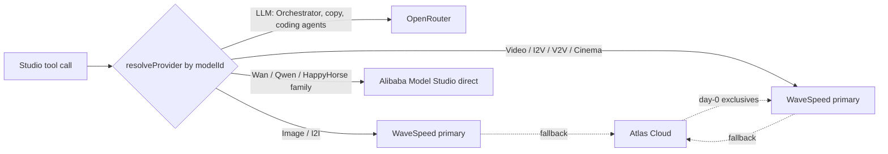

# Helmies Studio — Financial Model & Provider Strategy

> Companion doc to [helmies-studio-blueprint.md](helmies-studio-blueprint.md) and [helmies-studio-review.md](helmies-studio-review.md).
> This document answers, in order: *should you mostly use OpenRouter?*, *how will the connection work?*, *how will you actually make money?*, and *how do the 4 candidate providers compare?* — then ends with one final, concrete plan.
>
> **Hard constraint honored throughout:** muapi (not recommended - remove) is treated as a *comparison baseline only*. It is not recommended as the go-forward provider. Every recommendation below works without it.

---

## 0. TL;DR

| Question | Short answer |
|---|---|
| Should I mostly use OpenRouter? | **For LLM/text: yes.** For image/video/audio/lipsync generation (your actual paid product): **no** — OpenRouter's media catalog is small and largely a pass-through of the same infra providers you'd use directly. Use it as your **agent brain**, not your **media engine**. |
| Which provider replaces muapi (not recommended - remove)? | No single one does. Run a **multi-provider pool**: **WaveSpeed** (primary media engine) + **Atlas Cloud** (secondary/day-0 fallback) + **Alibaba Model Studio** (direct source for Qwen/Wan-family only) + **OpenRouter** (LLM only). Your codebase's `providers.js` already anticipates this exact pattern — you're finishing something half-built, not starting over. |
| How will the connection work? | Same shape as today: submit → poll (or webhook) for media, plain request/response for LLM. The work is re-pointing `PROVIDERS` base URLs, remapping every model's `endpoint` slug in [models.js](src/lib/models.js), and (ideally) swapping polling for webhooks. Full technical steps are in [helmies-studio-integration-setup.md](helmies-studio-integration-setup.md). |
| How do I make money? | Two independent levers already exist in your code: (1) `DEFAULT_MARKUP = 2.5` on raw provider cost when pricing each generation, and (2) subscription price vs. credits granted. Revenue = subscriptions (predictable MRR) + optional pay-as-you-go top-ups, with "breakage" (unused credits) as pure margin on top. See §4 for the worked example. |

---

## 1. What "should I use OpenRouter" actually means — read the catalog shape first

This is the crux of the whole decision, so the evidence comes first.

OpenRouter's own model directory (fetched live) breaks down like this:

| Modality on OpenRouter | Model count |
|---|---|
| Text (LLM) | **339** |
| Image | 36 |
| Embeddings | 27 |
| Video | 17 |
| Speech (TTS) | 12 |
| Transcription (STT) | 11 |
| Rerank | 4 |
| Audio | 4 |

That's ~20x more text models than image models, and ~20x more than video. OpenRouter is, fundamentally, an **LLM router with a growing but secondary media catalog bolted on** — not a media-generation aggregator like muapi (not recommended - remove)/WaveSpeed/Atlas, which each host 400–1000+ generation-specific models (video, image, lipsync, audio, motion) as their *core* product.

There's a second, important clue in the research: Atlas Cloud's own marketing explicitly advertises **"Unified access to Atlas Cloud models through OpenRouter"** — meaning at least some of OpenRouter's image/video models are themselves proxied through an upstream infra provider like Atlas Cloud, not run by OpenRouter directly. In other words, if you generated video "via OpenRouter," you might already be paying an extra hop of markup on top of the same underlying Atlas/WaveSpeed-style infrastructure you could call directly.

**What this means for Helmies Studio specifically:**

- Your `ImageStudio`, `VideoStudio`, `LipSyncStudio`, `AudioStudio`, `RecastStudio`, `ClippingStudio`, `CinemaStudio`, `MarketingStudio`, `AiInfluencerStudio` — i.e. essentially your entire paid product surface — need a **dedicated media-generation aggregator**, not OpenRouter.
- Your `OrchestratorChat` (the planning/reasoning brain that decides *what* to generate and drafts prompts) is a **pure text/LLM job**. That's exactly what OpenRouter is best-in-class at, and — importantly — `llmComplete()` in [src/lib/providers.js](src/lib/providers.js) is **already wired correctly** to OpenRouter's `/chat/completions` endpoint. You don't need to change this part.

**Verdict:** Don't pick OpenRouter *instead of* a media provider. Keep it exactly where it already sits (the reasoning layer), and choose a separate primary provider for generation. That's not a compromise — it's the architecturally correct split, and it's also cheaper: LLM calls for planning/prompt-drafting are pennies; media generation is where real cost and margin live.

---

## 2. The 4 candidates, compared head-to-head

### 2.1 Business model & fit

| Provider | What it actually is | Catalog size | Billing model | Best-fit role for Helmies |
|---|---|---|---|---|
| **OpenRouter** | LLM router (+ small media add-on) | 339 text / 36 image / 17 video / 4 audio | Prepaid credit balance, pay-per-token at list price, OpenAI-SDK compatible | **Orchestrator brain**, coding/marketing-copy agents, prompt drafting/expansion |
| **WaveSpeed AI** | Multi-modal generation aggregator | 1000+ (image/video/audio/3D/LLM) | Pay-per-use, tiered account levels (Bronze→Ultra) unlocked by lifetime top-up, $1 trial credit | **Primary media engine** — broadest catalog, per-second/per-image transparent pricing |
| **Atlas Cloud** | Multi-modal generation aggregator, OpenAI-compatible | 400+ | Pay-as-you-go, no monthly minimum | **Secondary/day-0 fallback** — aggressive new-model pricing, SOC2+HIPAA, own "Photon" inference engine |
| **Alibaba Model Studio (DashScope)** | First-party source for Qwen (LLM) + Wan/HappyHorse (video) | Qwen + Wan + HappyHorse families, first-party only | Pay-per-use + optional "Token Plan" subscription + off-peak discount (up to 80%, time/region-restricted) | **Direct source for Wan/Qwen-family models only** — cuts out reseller margin on your highest-volume video family |
| **muapi (not recommended - remove)** *(baseline, not recommended)* | Multi-modal aggregator, current provider | ~500 | Pay-per-generation, credits never expire, webhooks supported | Comparison point only |

### 2.2 Price reality check — same models, different providers

No provider wins on every model. Here's what the live research actually showed for comparable jobs:

| Model / job | muapi (not recommended - remove) (not recommended) | Atlas Cloud | WaveSpeed | Alibaba direct |
|---|---|---|---|---|
| Seedance 2.0 (T2V, ~5s clip) | ~$0.60 flat | ~$0.45–0.56 (promo $0.09/s → full $0.112/s) | ~$0.10/s (Fast tier) → ~$0.50 for 5s | n/a (ByteDance model, not Alibaba) |
| Veo 3 Fast (I2V) | $0.60 flat | not confirmed | $0.15/s → ~$1.20 for 8s | n/a (Google model) |
| Wan / HappyHorse video | via reseller markup | via reseller markup | via reseller markup | **$0.14–0.18/s direct, no reseller markup** |
| Nano Banana (image) | ~$0.03/img (their claim) | not confirmed in this exact tier | Nano Banana 2: $0.07/img, Pro: $0.14/img | n/a |
| Flux 2 Klein (image) | n/a in this catalog | not confirmed | **$0.008/img** | n/a |
| Kling 3.0 Std (video) | via reseller markup | not confirmed | **$0.084/s** | n/a |

**Reading this honestly:** muapi (not recommended - remove) is already fairly competitive on flat-fee models (Veo3, Seedance), which is *why* it was picked originally — it's not a bad service, it's a strategic/branding choice to move away from it. WaveSpeed wins on raw catalog breadth and has the cheapest confirmed per-unit prices on several models (Flux 2 Klein, Kling 3.0). Atlas wins on **day-0 access to brand-new models** at aggressive intro pricing plus enterprise compliance badges (useful later if you ever pitch agencies/enterprises). Alibaba direct is unambiguously the cheapest path specifically for **Wan/Qwen/HappyHorse** models, because every reseller (muapi (not recommended - remove), Atlas, WaveSpeed) is marking up on top of Alibaba's own wholesale DashScope rate for those exact models.

**A second, live pull directly from WaveSpeed's own pricing page sharpens — and partly corrects — this:**

| Model | WaveSpeed price | vs. muapi (not recommended - remove) equivalent(not recommended) |
|---|---|---|
| Seedance 2.0 (image-to-video) | $0.60 → **$0.54** with a 10% live promo | ~$0.60 flat — essentially **at parity**, not cheaper |
| Seedream 5.0 Pro (text-to-image) | $0.045 → $0.04275 (5% promo) | not directly comparable (newer model generation) |
| GPT Image 2 (text-to-image / edit) | $0.06 / $0.07 → $0.057 / $0.0665 (5% promo) | not in muapi (not recommended - remove)'s catalog at time of research |

**Correction to the "WaveSpeed is cheaper" framing above:** on at least one direct apples-to-apples model (Seedance 2.0), WaveSpeed and muapi (not recommended - remove) charge almost exactly the same. **The case for WaveSpeed isn't "always cheaper" — it's catalog breadth (1,000+ models, confirmed live on `wavespeed.ai/docs`), confirmed webhook support, a confirmed synchronous mode for fast models, and a 99.99%-uptime/SOC2-Type-II claim.** Price alone is not a sufficient reason to switch on every model; expect some models to cost the same or more than muapi (not recommended - remove), and treat WaveSpeed's edge as operational (breadth + reliability + webhooks), not purely economic.

**WaveSpeed's account tiers, exact thresholds (confirmed directly from their docs):**

| Tier | Trigger |
|---|---|
| Bronze (default) | New account — $1 trial credit; some models excluded on trial |
| Silver | Any single top-up under $1,000 |
| Gold | A single top-up of $1,000–$4,999 |
| Ultra | A single top-up of $5,000+ |

This matters for cash-flow planning (§4): a bigger single top-up unlocks a materially better tier — worth batching top-ups rather than drip-feeding small amounts once usage volume justifies it.

**Caveats, stated plainly:**
- "30% avg savings" (muapi (not recommended - remove)) and "cut costs up to 67%" (WaveSpeed) are the providers' own marketing claims, not independently verified — treat as directional, not exact.
- Alibaba's exact *billing* mechanics (invoicing, VAT handling) are still not directly confirmed (their billing docs page 404'd during research), but the **account/region setup mechanics are now confirmed directly from their own onboarding docs**: you need a full Alibaba Cloud account, an activated Model Studio workspace, an API key, *and* a **Workspace ID that must be embedded in the base URL itself** (e.g. `https://{WorkspaceId}.ap-southeast-1.maas.aliyuncs.com/compatible-mode/v1` for Singapore) — this is real, confirmed integration friction beyond "get an API key," not a hypothetical concern. See [helmies-studio-integration-setup.md](helmies-studio-integration-setup.md) §1.2 for the exact pattern and the recommended EU region.

### 2.3 Integration complexity

| Provider | Auth model | Request shape | Fits existing `submitAndPoll()`? |
|---|---|---|---|
| OpenRouter | Bearer API key | Sync `/chat/completions` (or streaming) | N/A — no polling needed, already implemented |
| WaveSpeed | Bearer API key | Submit → poll `/predictions/{id}/result` (same shape as muapi (not recommended - remove)) | **Yes, near drop-in** |
| Atlas Cloud | Bearer API key, OpenAI-compatible | Submit → poll, OpenAI-compatible surface for some endpoints | **Yes, near drop-in** |
| Alibaba DashScope | Alibaba Cloud access key **+ mandatory Workspace ID embedded in the base URL** + explicit region choice (Beijing / Singapore / Tokyo / Frankfurt / Hong Kong — confirmed from their own onboarding docs) | **Qwen (LLM): trivial** — fully OpenAI-SDK-compatible sync chat completions, same shape as OpenRouter. **Wan/HappyHorse (video): harder** — native DashScope async job handling, not OpenAI-compatible | **Partial** — Qwen/LLM is a simple OpenAI-client base-URL swap; Wan/HappyHorse video needs a small dedicated adapter |

This confirms the recommended split in §3: WaveSpeed and Atlas can be plugged into the *existing* provider abstraction almost immediately; Alibaba is worth doing only for the Wan/Qwen cost win, as a separate, smaller integration effort.

---

## 3. Recommended provider strategy

Your codebase's [src/lib/providers.js](src/lib/providers.js) already defines a `PROVIDERS` registry (`muapi (not recommended - remove)`, `atlas`, `alibaba`, `wavespeed`, `openrouter`) and a `resolveProvider(modelId)` function that looks up per-model routing from the database (`ModelPricing` / `ProviderConfig`), falling back to a default. **This is the correct architecture for exactly this situation** — you don't need to rip anything out, you need to finish wiring it and stop defaulting to muapi (not recommended - remove).

Recommended assignment:



- **OpenRouter** — all LLM traffic: Orchestrator planning, marketing/coding copy agents, prompt expansion/translation.
- **WaveSpeed** — default primary for image, I2I, video, I2V, V2V, cinema, lipsync, audio, recast, clipping. Broadest catalog means the fewest "model not available" gaps versus your current 21+11+10+7+4+8+2+7 model catalog in [models.js](src/lib/models.js).
- **Atlas Cloud** — secondary/fallback provider, and primary for whichever brand-new model drops there first (their pricing page shows they move fast on day-0 releases). Also your enterprise-compliance story (SOC2 + HIPAA) if you ever sell to agencies.
- **Alibaba Model Studio** — direct integration reserved specifically for Qwen-text and Wan/HappyHorse-video model IDs, to avoid paying reseller margin on what is likely your highest-volume video family. Do this **second**, after the WaveSpeed/Atlas swap is stable, since it needs its own adapter (§2.3).
- Keep the `resolveProvider()` DB-driven override so you can shift individual models between providers without a deploy — this is the actual point of that abstraction already existing in your code.

---

## 4. How you'll make money

### 4.1 The two levers that already exist in your code

Your [src/lib/pricing-engine.js](src/lib/pricing-engine.js) defines:

```js
DEFAULT_MARKUP = 2.5        // multiplier over raw provider cost
CREDIT_TO_EUR  = 0.01       // 1 credit = €0.01 of *already-marked-up* retail value
calculateCredits(providerCost, markup) =
    Math.ceil((providerCost * markup) / CREDIT_TO_EUR)
```

This means the 2.5x margin is baked in **at the moment a generation's credit cost is computed** — not later. A generation costing you €0.10 from the provider is priced at €0.25 retail (2.5x), which becomes 25 credits charged to the user.

That gives you **two separate, stackable levers**:

1. **Per-generation markup** (2.5x, adjustable per model via the admin Pricing tab) — this is your gross margin *per unit of usage*.
2. **Subscription price vs. credits granted** — this is a *second*, independent margin layer, because you're not obligated to price a plan at exactly "credits granted × €0.01." You can sell €10-worth of already-marked-up usage capacity for €19, €25, or whatever the market bears.

### 4.2 Worked example (illustrative numbers — plug in your real Stripe prices)

Say your "Starter" plan grants **1,000 credits/month** (this figure is real, from `SUBSCRIPTION_CREDITS` in your code):

- Nominal retail value of 1,000 credits = 1,000 × €0.01 = **€10** (this €10 already contains the 2.5x markup, i.e. it represents ~€4 of raw provider cost).
- If you price the Starter plan at, say, **€19/month** *(illustrative — set your real number in Stripe)*:
  - A typical user who consumes ~70% of their credits (30% "breakage," common in usage-capped SaaS): actual cost to you ≈ €4 × 0.70 = **€2.80**. Gross margin ≈ €19 − €2.80 = **€16.20 (~85%)**.
  - A power user who burns 100% of their credits every month: cost to you = **€4**. Gross margin ≈ €19 − €4 = **€15 (~79%)**.
- **The model stays healthy even at full utilization**, because the 2.5x markup is already inside the credit cost — the subscription price on top of that is closer to pure profit than a typical "cost + tiny margin" SaaS.

This is the same "gym membership" economics that make consumption-capped AI SaaS products profitable: **fixed recurring fee + usage ceiling + real-world underutilization = predictable margin**, even before subscription price is optimized.

**Two risks directly threaten this model — both now confirmed by direct code inspection this pass, not just the prior audit:**

1. The `image`, `video`, and `lipsync` generation routes bypass the dynamic DB-driven pricing (`resolveProvider` + `calculateCredits`) and instead charge from a **static hardcoded table** in `credits.js`.
2. **New finding:** [src/lib/agents.js](src/lib/agents.js)'s own step-executors (`executeImageStep`, `executeVideoStep`, `executeAudioStep`) import `generateImage`/`generateVideo`/`generateAudio` **directly from `@/lib/muapi (not recommended - remove)`**, not through `resolveProvider()` at all. This means even after the direct `/api/generate/*` routes are fixed, **the Orchestrator and every Workflow run will silently keep calling muapi (not recommended - remove)**, regardless of what's configured in `ProviderConfig`/`ModelPricing`. This is a second, independent bypass — fixing only #1 does not make this financial model true for Orchestrator/Workflow-driven usage.

If either bypass is left in place, margin silently erodes (or stays pinned to muapi (not recommended - remove)'s cost structure) for exactly the traffic that skips the shared pricing path — **fix both before or during the provider migration**.

**Turn the `providerCost` field you already have into an actual margin dashboard.** Your `Generation` model already has a `providerCost Float?` column sitting next to `creditsUsed` — the raw ingredients for real (not theoretical) margin reporting already exist in the schema. Once both bypasses above are fixed so `providerCost` is populated accurately for every tool, a simple report — `SUM(creditsUsed) × CREDIT_TO_EUR` (retail revenue) vs. `SUM(providerCost)` (actual cost), grouped by `tool`/`model` — tells you your *real* margin per model, not the theoretical 2.5x. This becomes materially more valuable once 3+ providers have different real costs for the same nominal model.

**`ProviderConfig.markup` is per-provider, not global** — confirmed from the schema, it's a `Float` column on each provider's own row, defaulting to 2.5. Use this deliberately: e.g. a slightly lower markup on WaveSpeed (whose pricing page is public and price-comparable) and a higher markup on Alibaba-direct exclusive models (where there's no easy public price for a customer to compare against).

### 4.3 Real costs that eat into the 2.5x markup (not modeled in the code today, worth planning for)

The 2.5x markup and credit-vs-subscription math above is gross margin *before* these standard costs of actually running the business:

- **FX exposure.** WaveSpeed, Atlas, and Alibaba all bill in **USD**; Stripe revenue (per the live Stripe keys already configured in `.env`) is presumably charged in **EUR**. A weakening EUR/USD rate directly compresses margin on the cost side even if credit pricing stays flat — worth either re-pricing periodically against a reference rate, or holding a small USD buffer for provider top-ups.
- **Payment processing fees.** Stripe's own cut (typically ~1.5–2.9% + a fixed per-transaction fee for EU cards, more for international cards) comes out of the top-line price before any of the §4.2 margin math applies — small per-unit, but worth modeling at scale.
- **VAT/OSS obligations.** Selling digital subscriptions to EU consumers generally requires charging and remitting VAT at the customer's local rate (via the EU's One-Stop-Shop scheme), not a single flat rate — a compliance line item, not just a technical one; confirm with an accountant before scaling EU consumer revenue.
- **Refunds.** The schema already has a `Refund` model (`amount`, `reason`, `status`) — budget for this as a real, small but nonzero cost line, especially during the provider-migration window when output reliability may be less predictable than the already-tuned muapi (not recommended - remove) integration.

### 4.4 Additional revenue levers worth adding

These aren't currently in the codebase (based on the routes reviewed) but are standard, low-risk additions:

1. **Pay-as-you-go credit top-ups** — a "buy 500 credits, no subscription" option, independent of the 4 subscription tiers. Every competitor researched (muapi (not recommended - remove), WaveSpeed, Atlas) offers this; it captures users who won't commit to a recurring plan yet still want to try the product.
2. **Annual billing discount** (e.g. "2 months free" for annual vs monthly) — improves cash flow and reduces churn, zero engineering cost beyond a second Stripe Price per plan.
3. **Overage packs at the point of friction** — when a user's estimated cost (your existing `/api/estimate` route) exceeds their remaining balance, surface a "top up now" CTA inline instead of just blocking the generation. This is a proven upsell moment.
4. **Team/agency seats** — shared or delegated credit pools under one billing entity. Bigger lift (needs an `Organization` model in Prisma), worth planning for once single-user revenue is validated, not immediately.
5. **API access tier** — the prior audit found `ApiKey` model + `/api/user/keys` exist but nothing actually authenticates against them yet. Once wired up, this becomes a separate, metered revenue line for developers who want programmatic access, priced independently from the consumer credit system.
6. **Affiliate/referral program** — WaveSpeed runs one; low-effort, recurring acquisition channel once you have a base of active users.
7. **(Longer-term, optional) White-label your own stack to other studios/agencies** — once the Orchestrator/Workflows/Project Memory system is proven, you're in a *stronger* position than muapi (not recommended - remove)'s own white-label play (see [helmies-studio-integration-setup.md](helmies-studio-integration-setup.md) §5 for why): you'd own 100% of the IP and margin, rather than reselling someone else's infrastructure under your name.

---

## 5. Migration checklist — moving off muapi (not recommended - remove) without breaking the product

This is real work, not an environment-variable swap, because [src/lib/models.js](src/lib/models.js)'s current catalog (21 image / 11 I2I / 10 video / 7 I2V / 4 V2V / 8 lipsync / 2 recast / 7 audio models, plus cinema/marketing/influencer configs) stores **muapi (not recommended - remove)-specific endpoint slugs** (e.g. `veo3-text-to-video`, `seedance-pro-t2v`) as each model's identity. Every other provider names the same underlying models differently.

1. **Audit model-for-model**: for each entry in `models.js`, confirm the same underlying model exists on WaveSpeed/Atlas, and note its endpoint slug there. Some models may only exist on one provider — that's fine, `resolveProvider()` is per-model already.
2. **Fix the Atlas base URL bug**: [src/lib/providers.js](src/lib/providers.js) currently hardcodes `baseUrl: "https://api.atlas.cloud"` for the `atlas` provider — the real service found in research is at `atlascloud.ai`. Confirm the correct API host from Atlas's own docs before wiring requests.
3. **Populate `ProviderConfig` / `ModelPricing`** in the database (via the existing admin Providers/Pricing tabs) so `resolveProvider()` actually routes to WaveSpeed/Atlas instead of falling back to muapi (not recommended - remove).
4. **Fix the 3 bypass routes** (`image`, `video`, `lipsync` — per the prior audit) so they go through `resolveProvider()` + `calculateCredits()` like every other tool, instead of the static muapi (not recommended - remove)-only table in `credits.js`.
5. **Generalize or replace `muapi (not recommended - remove).js`**: its functions (`generateImage`, `generateVideo`, `generateI2V`, `processLipSync`, etc.) are currently hardcoded to muapi (not recommended - remove)'s endpoints. Either add sibling files (`wavespeed.js`, `atlas.js`) with the same function signatures, or refactor into one provider-agnostic module that takes a resolved provider + endpoint.
6. **Decide on muapi (not recommended - remove)'s fate**: keep it registered as a low-priority fallback (safety net during migration) or remove it entirely once confidence in the new providers is high. Either way, stop it from being the *default*.
7. **Re-verify pricing after the swap** — some models will cost more, some less, on the new providers (see §2.2). Re-run `calculateCredits()` for every model and confirm the 2.5x markup still produces a sane credit price.

---

## 6. Final plan

1. Keep OpenRouter exactly where it is (LLM/Orchestrator brain) — no change needed there, it's already correct.
2. Stand up **WaveSpeed** as the new default media provider across all generation studios.
3. Register **Atlas Cloud** as the automatic fallback + your day-0/new-model source (fix the base URL bug first).
4. Add a **dedicated Alibaba Model Studio adapter**, scoped only to Wan/Qwen/HappyHorse-family models, once the above two are stable — this is where the direct-source discount actually matters.
5. Fix the 3 pricing-bypass routes so every studio shares the same dynamic markup logic — this is what makes the §4 financial model actually true in production.
6. Layer in pay-as-you-go top-ups and annual billing as the first two "new revenue" additions — both are low-effort, high-standard-practice wins.
7. Leave muapi (not recommended - remove) registered but deprioritized until the migration is validated, then remove it.

Full technical steps for items 2–5 continue in [helmies-studio-integration-setup.md](helmies-studio-integration-setup.md).
